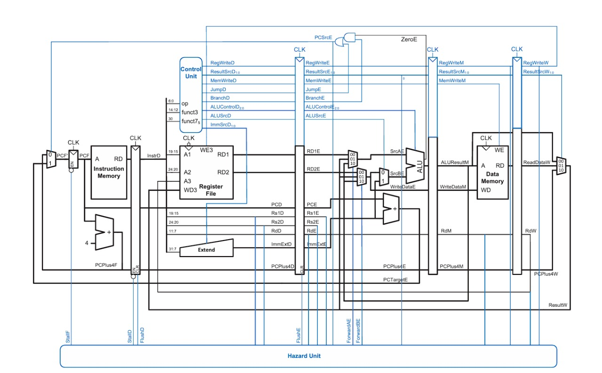

# RVX10-P: A 5-Stage Pipelined RISC-V Core

**RVX10-P** is a Five-Stage Pipelined RISC-V Core supporting **RV32I + 10 Custom ALU Instructions**, developed under the course *Digital Logic and Computer Architecture* taught by **Dr. Satyajit Das**, IIT Guwahati.

---

## 📁 Project Structure

This repository contains the complete project, organized as follows:

* **/src** — All Verilog/SystemVerilog source files for the processor, including:
  - `riscvpipeline.sv` — Top-level wrapper integrating datapath, control, and memory modules.  
  - `controller.sv` — Control logic for instruction decoding and pipeline control.  
  - `datapath.sv` — Core datapath implementing the five pipeline stages.  
  - `hazard_unit.sv` — Handles hazard detection and stall control.  
  - `forwarding_unit.sv` — Implements data forwarding for pipeline efficiency.  
  - `Remaining_Modules.sv` — Other supporting modules (register file, ALU, etc.).

* **/tb** — Contains the testbench (`tb_pipeline.sv`) and memory initialization files (e.g., `rvx10_pipeline.hex`).

* **/docs** — Contains documentation and design diagrams:
  - `REPORT.md` — Detailed project report including architecture and hazard analysis.
  - `pipeline_overview.png`, `Control_Hazard.png`, `Load_Hazard.png`, `Forwarding_Hazard.png`, and `ImplementedArchitecture.png`.

---

## 🧠 Pipelined Processor Implemented

Below is the architecture diagram of the implemented 5-stage pipelined RISC-V core:


---

## 📝 Notes

- The detailed report (`REPORT.md`) is available in the **/docs** folder.  
- Ensure that all source files in `/src` are compiled together before running the simulation.  
- The design is modular and supports extension for additional instructions or pipeline optimizations.

---

## 🧩 Compilation (Example)

To compile and simulate using **Icarus Verilog**:

```bash
iverilog -g2012 -o rvx10p_tb \
src/controller.sv \
src/datapath.sv \
src/forwarding_unit.sv \
src/hazard_unit.sv \
src/Remaining_Modules.sv \
src/riscvpipeline.sv \
tb/tb_pipeline.sv
vvp rvx10p_tb
